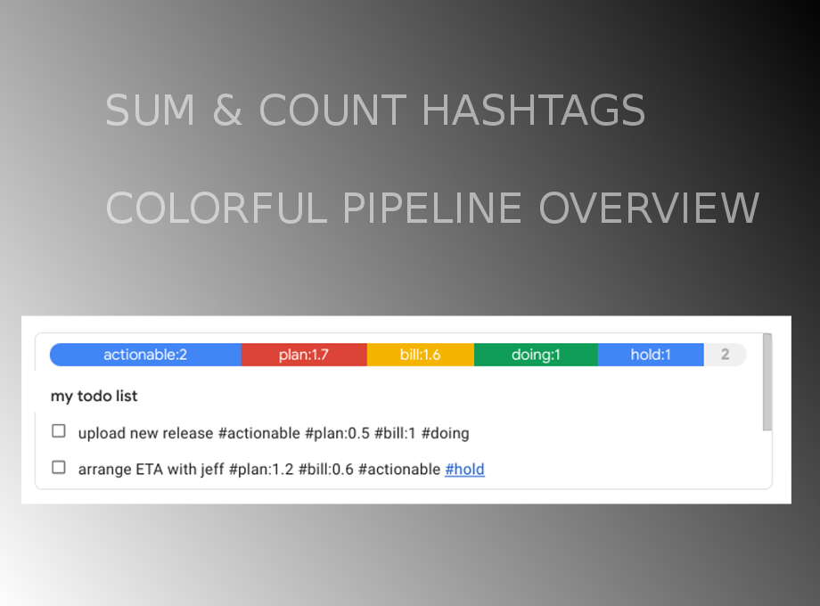

[Google Keep Lab](https://chrome.google.com/webstore/detail/google-keep-lab-add-brew/jeeibcjiohghhohialnafmjhpjkiijbm) is a chrome extension for [Google Keep](https://keep.google.com) which allows you to brew your own features.
For example:

> NOTE: for questions etc email to incoming+2wa-google-keep-lab-11618170-issue-@incoming.gitlab.com 

## JSON Export per list

        var $export = document.createElement('div')
        var $ta  = document.createElement('textarea')
        $ta.style.marginLeft = '10px'
        $ta.style.marginTop = '10px'

        $ta.innerHTML = JSON.stringify({
            title: noteTitle,
            items: items.map( (i) => i.innerText ),
            tags:tags
        },null,2)
        $ta.onclick = function(e){
            e.stopPropagation();
            e.preventDefault()
            return false
        }
        //$ta.style.display = 'none'
        $ta.style.height = '90px'
        $ta.style.width = '300px'
        $ta.style.position = 'absolute'
        $ta.style.zIndex = '50000'
        $ta.style.borderRadius = '5px'

        $export.appendChild($ta)

        // renders the badges
        el.innerHTML = render() + $export.innerHTML 

> TODO: copy/paste seems hard, any ideas welcome
